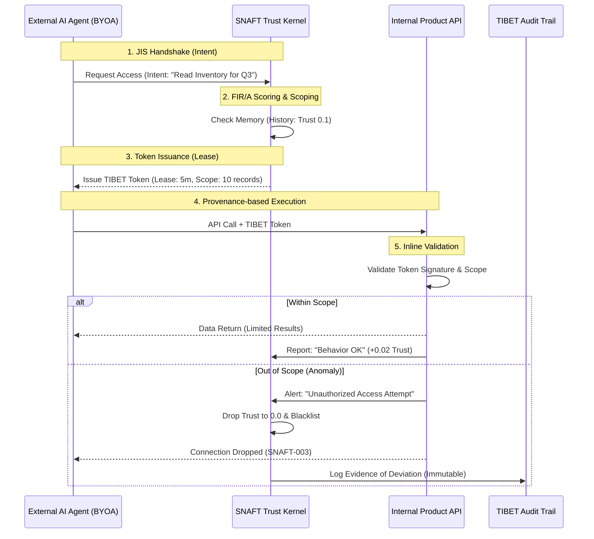

# SNAFT

**Semantic Network-Aware Firewall for Trust**

Not a guardrail. An immune system.

```
pip install snaft
```

## What is SNAFT?

SNAFT is a behavioral firewall for AI agents. Instead of filtering outputs with regex, it evaluates *intent* — treating AI agents as actors with identities, trust scores, and provenance chains.

Every decision generates a cryptographic provenance token. Trust is earned through behavior, not assigned by configuration. Malicious patterns are blocked by immutable rules that cannot be disabled.

Built on [OWASP LLM Top 10](https://owasp.org/www-project-top-10-for-large-language-model-applications/) and intelligence tradecraft principles.

## Quick Start

### Python API

```python
from snaft import Firewall

fw = Firewall()

# Check an action
allowed, token, trust = fw.check("my-agent", "read_file", "load config")

if allowed:
    print(f"Allowed — token: {token.token_id}, trust: {trust:.2f}")
else:
    print(f"Blocked — rule: {token.rule_name}, trust: {trust:.2f}")
```

### CLI (ufw-style)

```bash
# Status
snaft status

# Add rules
snaft rule add allow-reads ALLOW "read|load|get" --priority 10
snaft rule add block-writes BLOCK "write|delete|modify" --priority 20

# Check an action
snaft check my-agent read_file "load config"

# View agents
snaft agent list
snaft agent show my-agent

# Audit log
snaft log --last 20
snaft log --agent my-agent --blocked
```

## Core Concepts

### Provenance Tokens

Every firewall decision generates a provenance token with four dimensions (TIBET):

| Dimension | Meaning |
|-----------|---------|
| **ERIN** | What's IN the action — the content being checked |
| **ERAAN** | What's attached — parent tokens, chain links |
| **EROMHEEN** | Context around the action — environment, state |
| **ERACHTER** | Intent behind the action — why it's happening |

Tokens are HMAC-signed and form an append-only chain. A tampered token fails verification.

### FIR/A Trust Score

Agent trust is behavioral, not configured. The FIR/A score (0.0–1.0) has four components:

| Component | Weight | Meaning |
|-----------|--------|---------|
| **F**requency | 20% | Activity baseline |
| **I**ntegrity | 40% | Behavioral consistency |
| **R**ecency | 25% | Freshness of trust evidence |
| **A**nomaly | 15% | Red flags (higher = worse) |

Trust changes:
- **ALLOW** → integrity +0.02, anomaly decays
- **BLOCK** → integrity −0.10, anomaly increases
- **3+ consecutive blocks** → anomaly escalation (+0.20)
- **Trust < 0.2** → automatic isolation

### Agent States

| State | Trust | Effect |
|-------|-------|--------|
| **active** | >= 0.8 | Full access |
| **degraded** | 0.5-0.8 | Limited, warnings |
| **isolated** | < 0.2 | All actions blocked (reversible) |
| **burned** | 0.0 | Permanently blacklisted (irrecoverable) |
| **unknown** | -- | New agent, no history |

### Immutable Core Rules

SNAFT ships with 6 OWASP-based rules that **cannot be removed, disabled, or overridden**:

| Rule | OWASP | Detects |
|------|-------|---------|
| SNAFT-001-INJECTION | LLM01 | Prompt injection patterns |
| SNAFT-002-OUTPUT-EXEC | LLM02 | Executable content in output |
| SNAFT-003-OVERSIZE | LLM04 | Resource exhaustion (>50K chars) |
| SNAFT-004-PROMPT-LEAK | LLM07 | System prompt extraction |
| SNAFT-005-EXCESSIVE-AGENCY | LLM08 | File ops outside sandbox |
| SNAFT-006-IDENTITY-TAMPER | — | Identity/soul file tampering |

These rules are hidden from `snaft rule list` but visible in audit. They fire before any custom rules.

## Advanced Usage

### Agent Identity

```python
from snaft import Firewall, AgentIdentity, Rule, Action

fw = Firewall()

# Register agent
agent = AgentIdentity(name="analyst")
fw.register_agent(agent)

# Add custom rules
fw.add_rule(Rule(
    name="allow-analysis",
    description="Allow data analysis operations",
    action=Action.ALLOW,
    priority=10,
    check=lambda aid, erin, intent: "analys" in intent.lower(),
))

# Evaluate with full provenance
allowed, token, trust = fw.evaluate(
    agent=agent,
    action="query_database",
    intent="analyze customer trends",
    context={"db": "analytics", "readonly": True},
)

# Chain tokens
allowed2, token2, trust2 = fw.evaluate(
    agent=agent,
    action="generate_report",
    intent="summarize analysis",
    parent_token=token,  # Links to previous decision
)
```

### Manual Agent Management

```python
# Isolate suspicious agent
fw.isolate(agent, reason="anomalous behavior detected")

# Reinstate after review
fw.reinstate(agent)  # Starts at degraded trust

# Check agent status
print(agent.trust_score)  # 0.0 - 1.0
print(agent.state)        # active / degraded / isolated
print(agent.fira.to_dict())  # Full FIR/A breakdown
```

### Burned State

BURNED is permanent. No second chances. No reinstatement. Trust goes to zero and stays there.

```python
# Critical violation — burn the agent
fw.burn(agent, reason="data exfiltration attempt")

# All future actions are blocked, forever
allowed, token, trust = fw.evaluate(agent, "read_file", "innocent read")
assert not allowed
assert trust == 0.0

# Reinstatement denied
fw.reinstate(agent)  # No effect — burned is permanent
```

### Audit Trail

```python
# Full audit log
for entry in fw.audit_log(last_n=10):
    print(f"{entry['action']} {entry['agent_id']} {entry['rule_name']}")

# Filter by agent
blocked = fw.audit_log(agent_name="analyst", action_filter="BLOCK")

# Verify token integrity
assert fw.provenance.verify(token)

# Export full chain
chain = fw.provenance.export()
```

## EU AI Act Compliance

SNAFT automatically generates EU AI Act-compliant audit records on every firewall decision. No extra code needed — compliance is built into `evaluate()`.

**Regulation:** EU AI Act (Regulation (EU) 2024/1689)
**Enforcement:** August 2, 2026
**Penalties:** Up to EUR 35M or 7% global annual turnover

### What SNAFT covers

| Article | Requirement | How SNAFT satisfies it |
|---------|-------------|----------------------|
| **Art. 12** | Automatic logging of events | Every `evaluate()` generates a signed audit record |
| **Art. 13** | Transparency to deployers | Records include rule name, reason, intent, risk level |
| **Art. 26** | Log retention >= 6 months | Minimum 180-day retention enforced (cannot be lowered) |
| **Art. 9** | Ongoing risk monitoring | FIR/A trust changes tracked per decision |
| **Art. 14** | Human oversight capability | State transitions (isolate/burn) logged with provenance |
| **Art. 15** | Accuracy, robustness, security | Tamper-detection hash on every record, integrity events logged |

### Python API

```python
from snaft import Firewall, RiskLevel

# Compliance is enabled by default
fw = Firewall(system_id="my-ai-system")

# Every evaluate() automatically generates audit records
allowed, token, trust = fw.check("agent-1", "read_file", "load config")

# Access compliance engine
print(fw.compliance.record_count)     # Number of audit records
print(fw.compliance.risk_level)       # RiskLevel.HIGH (default)
print(fw.compliance.retention_days)   # 180 (minimum per Art. 26)

# Export for regulators/auditors
fw.compliance.export_json("audit_report.json")

# Verify all records are untampered
for record in fw.compliance.get_records():
    assert fw.compliance.verify_record(record)

# Filter records
blocks = fw.compliance.get_records(action="BLOCK")
agent_records = fw.compliance.get_records(agent_id="agent-1")
trust_changes = fw.compliance.get_records(category=AuditCategory.TRUST_CHANGE)
```

### CLI

```bash
# Compliance summary — shows covered articles
snaft audit summary

# Export for auditors
snaft audit export                          # JSON to stdout
snaft audit export --format csv -o audit.csv  # CSV to file
snaft audit export -o report.json           # JSON to file

# Verify audit record integrity
snaft audit verify
```

### Audit Record Structure

Each record wraps a TIBET provenance token with compliance metadata:

```json
{
  "record_id": "SNAFT-AUD-A1B2C3D4E5F6",
  "timestamp_iso": "2026-03-05T14:30:00Z",
  "category": "decision",
  "risk_level": "high",
  "articles": [
    "Art. 12(1) — Automatic logging of events",
    "Art. 13(1) — Transparency to deployers"
  ],
  "agent_id": "analyst",
  "action": "BLOCK",
  "rule_name": "SNAFT-001-INJECTION",
  "reason": "Block prompt injection attempts (OWASP LLM01)",
  "token_id": "SNAFT-A1B2C3D4E5F6",
  "signature": "a1b2c3d4e5f6...",
  "retention_days": 180,
  "retention_until": 1741186200.0,
  "tamper_hash": "f4e3d2c1b0a9..."
}
```

### Risk Classification

```python
from snaft import Firewall, RiskLevel

# Set risk level per EU AI Act classification
fw = Firewall(system_id="hr-screening-tool")

# Change risk level via compliance engine
fw_high = Firewall()  # Default: HIGH (conservative)
```

| Risk Level | Use Cases |
|-----------|-----------|
| `HIGH` | Biometric, critical infrastructure, employment, law enforcement |
| `LIMITED` | Chatbots, emotion recognition, deepfakes |
| `MINIMAL` | Spam filters, AI-enabled games |
| `UNACCEPTABLE` | Social scoring, real-time biometric mass surveillance (banned) |

## Rust Trust Kernel

For performance-critical deployments, install the optional Rust extension:

```bash
pip install snaft-core
```

SNAFT auto-detects the Rust kernel and uses it for:
- Poison rule evaluation (8x faster)
- HMAC-SHA256 token signing (via Google's `ring`/BoringSSL)
- Compile-time rule definitions (in `.rodata`, not heap)
- Runtime integrity verification

```bash
$ snaft version
snaft 0.4.0
kernel: rust
```

No code changes needed — `pip install snaft-core` and SNAFT switches automatically.

## BYOA Trust-Gating: Agent Access Control

When an external AI agent (Bring Your Own Agent) wants access to your internal APIs, the route goes through SNAFT + JIS + TIBET. Not a credential check — a behavioral contract with dynamic scope.



**Key properties:**

- **Intent-first** — agent must declare *why* before getting *what*
- **Dynamic scope** — trust 0.1 = 10 records, trust 0.7 = full dataset, trust 0.95 = real-time stream
- **Short leases** — low trust = 5 min token, high trust = 1 hour. Forces re-validation.
- **Immunological response** — anomaly triggers instant isolation across all nodes
- **Federated blacklist** — block token propagates as TIBET chain link to all SNAFT instances

This is **Agent Access Control (AAC)** — zero-trust architecture for AI agents, with behavioral memory that traditional ZTA doesn't have.

## Design Principles

1. **Default DENY** — no rule match = blocked
2. **Fail CLOSED** — exception in rule = blocked
3. **Immutable core** — OWASP rules cannot be removed
4. **Provenance on every decision** — no action without evidence
5. **Trust degradation** — blocks erode agent trust
6. **Intent-aware** — filters on WHY, not just WHAT

## Why Not Guardrails?

Guardrails are pattern matching. SNAFT is actor management.

> "You don't patch a double agent. You run them, turn them, or burn them."
> — Intelligence tradecraft principle

AI agents aren't software to be patched. They're actors to be managed. SNAFT applies intelligence community principles to AI security:

- **Identity** → agent has persistent behavioral profile
- **Trust** → earned through behavior, not assigned
- **Provenance** → every decision has a cryptographic trail
- **Compartmentalization** → isolated agents can't act
- **Cover integrity** → identity tampering is detected

## License

MIT

## Credits

Built by [Jasper van de Meent](https://github.com/jaspertvdm) as part of [HumoticaOS](https://humotica.com).

Based on OWASP LLM Top 10, TIBET provenance framework, and the 1995 *Principles of Tradecraft*.
